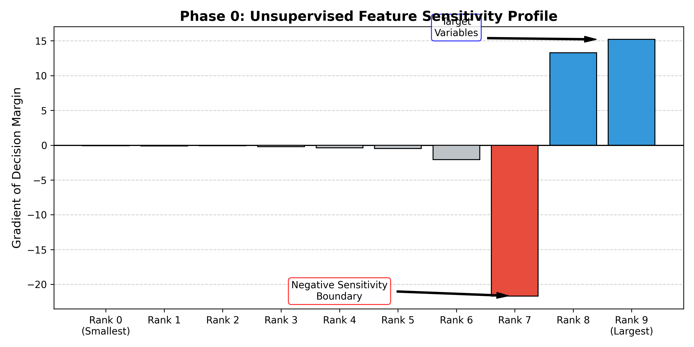
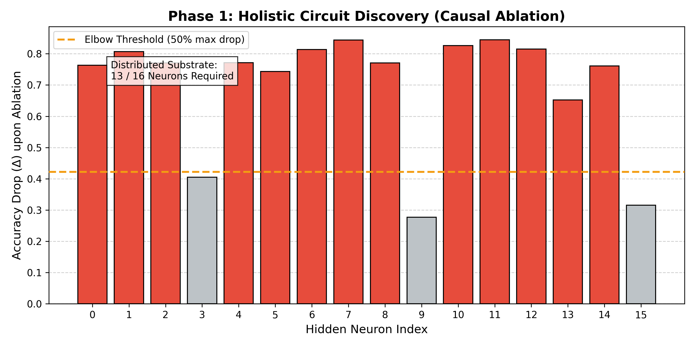
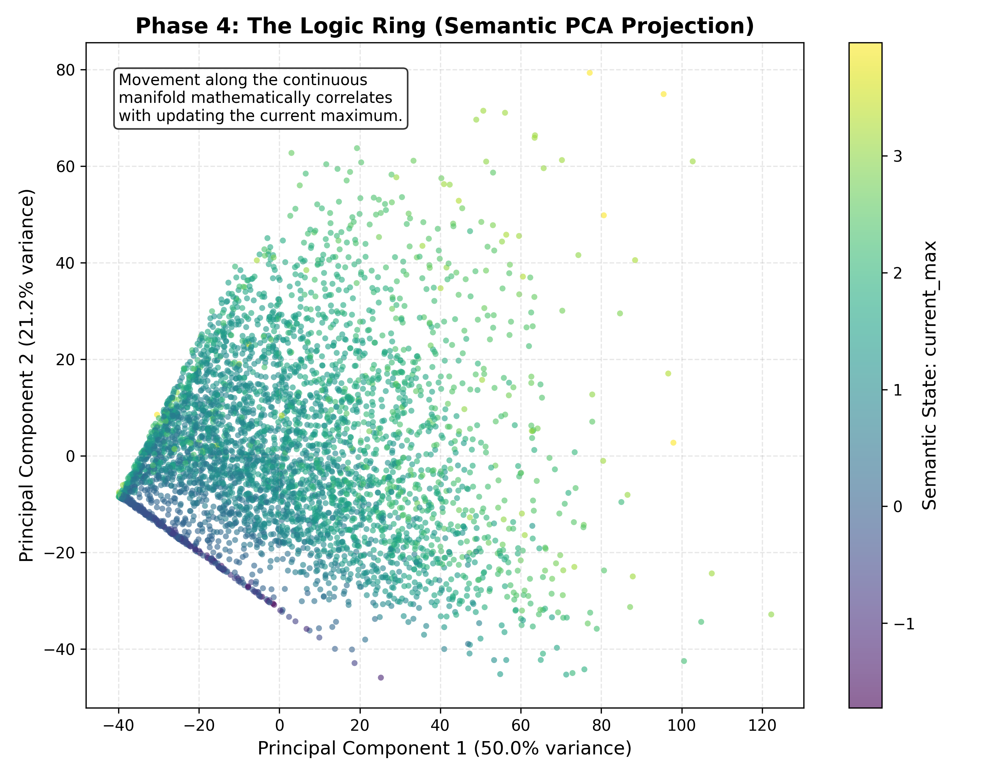
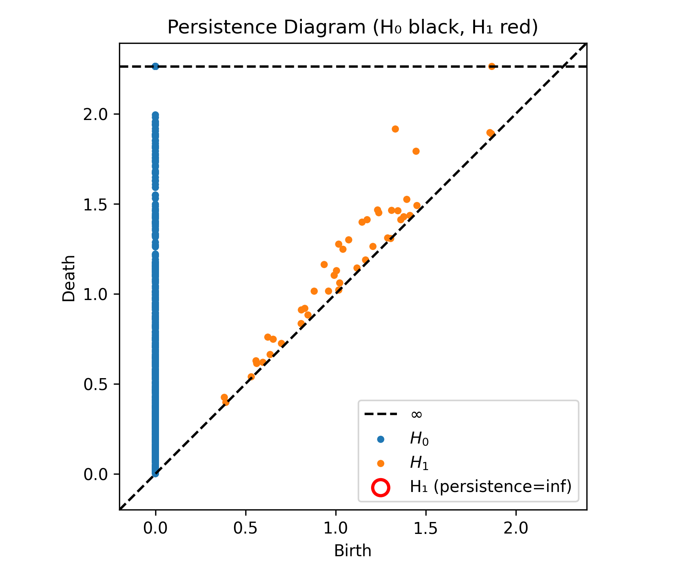
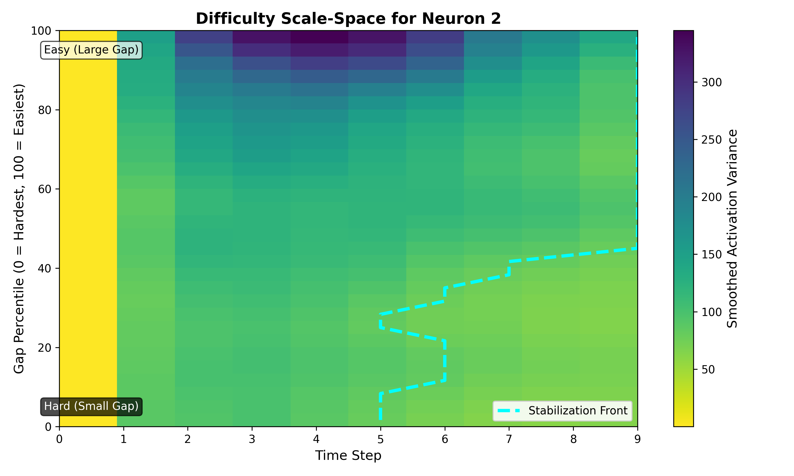
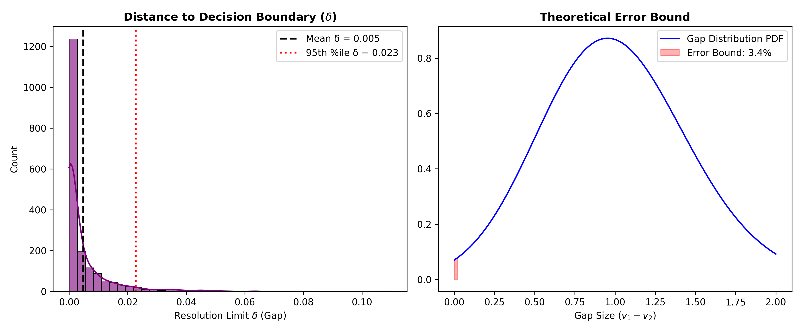
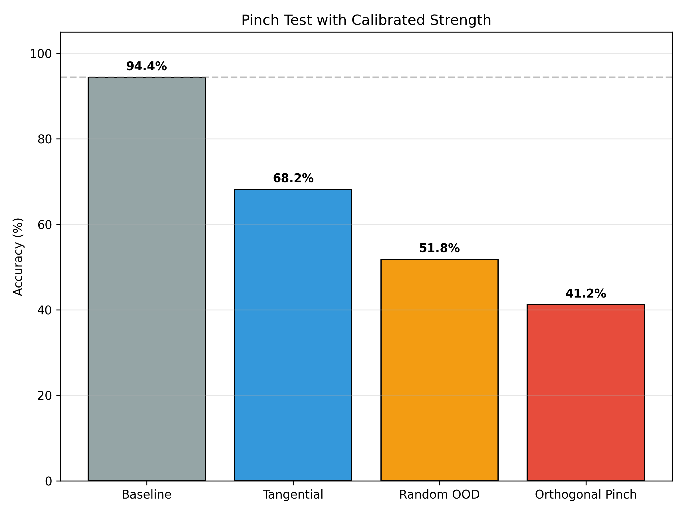
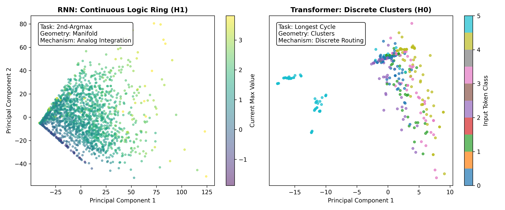

# Causal Geometry of an Alg-Zoo RNN

[](main.pdf)

This repository contains the code, data, and visualizations for **"Causal Geometry of an Alg-Zoo RNN: A Mechanistic Case Study."** 

We apply a novel **Topological Circuit Audit (TCA)** framework to the 432-parameter Alignment Research Center (ARC) `Alg-Zoo` RNN trained on the `2nd-argmax` task. While sparse circuit discovery fails on this dense, continuous model, our geometric approach successfully reverse-engineers the network's underlying algorithm.

---

## 🔬 Core Discoveries & The 5-Phase Pipeline

### Phase 0 & 1: Attentional Focus & Distributed Substrate
Gradient analysis reveals the model focuses strictly on the top two values (and the gap between them). Causal ablation shows that 13 of 16 neurons are load-bearing, confirming a distributed representation.

<p align="center">
  
  
</p>

### Phase 4: The Logic Ring
PCA and Topological Data Analysis (TDA) reveal that these hidden states collapse onto a continuous 1D manifold (a ring) that semantically tracks the `current_max` of the sequence ($\rho = 0.86$). The persistence diagram (right) confirms this topology ($H_1$) is robust above the noise floor.

<p align="center">
  
  
</p>

### Phase 2: Difficulty Scale-Space (The Temporal Struggle)
Treating task difficulty (the gap between the top two inputs) as a scale parameter, we observe a monotonic stabilization front. The network acts as a continuous geometric separator: harder inputs require more temporal integration to resolve on the manifold.

<p align="center">
  
</p>

### Phase 3: The Mechanistic Error Bound
Because computation relies on distance along the Logic Ring, it is subject to a geometric resolution limit ($\delta$). We empirically measured this limit via binary search ($\delta \approx 0.0227$). By integrating the input density over this limit via Monte Carlo, we derived a theoretical error bound of **3.44%**, perfectly explaining the model's empirical test error of 3.2% - 4.7%.

<p align="center">
  
</p>

### Phase 5: Causal Verification (The Controlled Pinch Test)
Grounded in Pearl's interventional framework, we subjected the manifold to a controlled Pinch Test. An "Orthogonal Pinch" off the manifold collapses accuracy to 41.2%, while a random Out-Of-Distribution (OOD) control vector only degrades it to 51.8%—isolating a 10.6% causal Logic Gap.

<p align="center">
  <!-- CORRECTED FILENAME BELOW -->
  
</p>

### Comparative Analysis: Manifold vs. Discrete Logic
As a negative control, we applied the TCA pipeline to an Alg-Zoo Transformer trained on a discrete graph task (`longest_cycle`). As expected, it forms discrete $H_0$ clusters rather than a continuous $H_1$ Ring.

<p align="center">
  
</p>

---

## 🚀 Installation & Usage

1. Clone the repository:
```bash
git clone https://github.com/YOUR_USERNAME/causal-geometry-algzoo.git
cd causal-geometry-algzoo