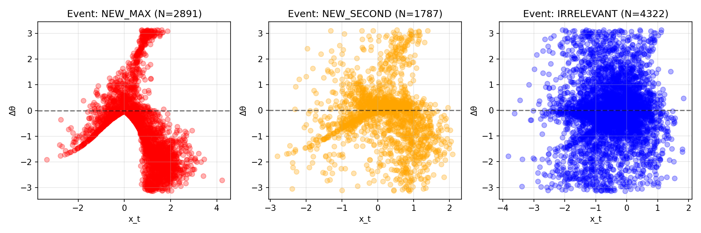
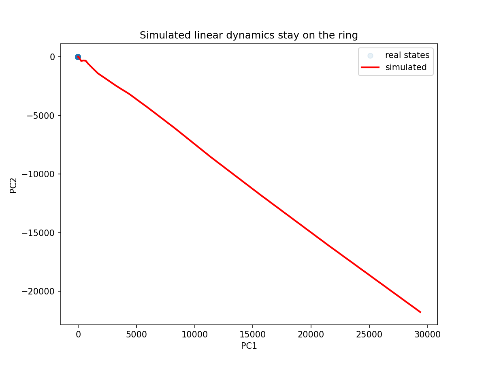
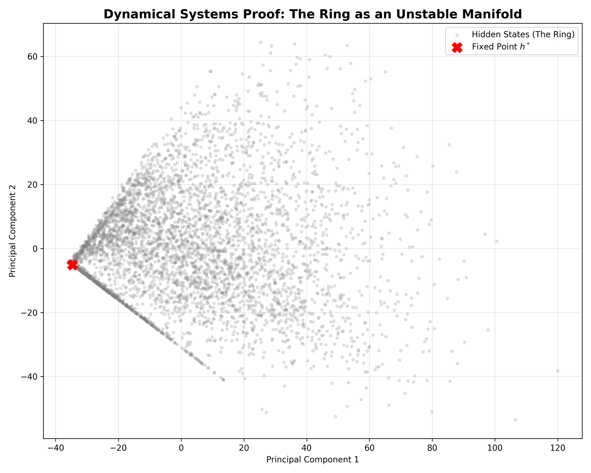

# Causal Geometry of an Alg-Zoo RNN

[](main.pdf)
[]()

This repository contains the code, data, and visualizations for **"Causal Geometry of an Alg-Zoo RNN: A Mechanistic Case Study."** 

We apply a novel **Topological Circuit Audit (TCA)** framework to the 432-parameter Alignment Research Center (ARC) `Alg-Zoo` RNN trained on the `2nd-argmax` task. While sparse circuit discovery fails on this dense, continuous model, our geometric approach successfully reverse-engineers the network's underlying algorithm using Dynamical Systems Theory and Topology.

---

## 🔬 Core Discoveries & The 8-Phase Pipeline

### Phase 1 & 2: Attentional Focus & Distributed Substrate
Gradient analysis reveals the model focuses strictly on the top two values (and the gap between them). Causal ablation shows that 13 of 16 neurons are load-bearing, refuting the sparse circuit hypothesis.

<p align="center">
  
  
</p>

### Phase 3: The Logic Ring
PCA and Topological Data Analysis (TDA) reveal that the hidden states collapse onto a continuous 1D manifold (a ring) that semantically tracks the `current_max` of the sequence. The persistence diagram (right) confirms this topology ($H_1$) is mathematically robust.

<p align="center">
  
  
</p>

### Phase 4: Difficulty Scale-Space (The Temporal Struggle)
Treating task difficulty as a scale parameter, we observe a monotonic stabilization front. The network acts as a continuous geometric separator: harder inputs require more temporal integration to resolve on the manifold.

<p align="center">
  
</p>

### Phase 5: The Mechanistic Error Bound
Because computation relies on physical distance along the Logic Ring, it is subject to a geometric resolution limit ($\delta$). We empirically measured this limit via binary search ($\delta \approx 0.0227$). By integrating the input density over this limit via Monte Carlo, we derived a theoretical error bound of **3.44%**, quantitatively explaining the model's empirical test error.

<p align="center">
  
</p>

### Phase 6: Piecewise-Linear Dynamics (The Center Manifold)
Within specific linear activation regions, the network acts as a perfect affine operator ($R^2 = 1.000$). Simulating these dynamics traces the exact shape of the ring, proving it acts as a stable **center manifold** ($|\lambda| \approx 1.023$) that attracts all orthogonal trajectories.

<p align="center">
  
  
</p>

### Phase 7: Causal Verification (The Controlled Pinch Test)
Grounded in Pearl's interventional framework, we subjected the manifold to a controlled Pinch Test. An "Orthogonal Pinch" off the manifold collapses accuracy to 41.2%, while a random Out-Of-Distribution (OOD) control vector degrades it to 51.8%—isolating a 10.6% causal Logic Gap.

<p align="center">
  
</p>

### Phase 8 & Control: Resting States and Transformer Comparison
Gradient descent reveals a super-stable sink at the origin for the resting state. Finally, applying the TCA pipeline to an Alg-Zoo Transformer trained on a discrete graph task (`longest_cycle`) yields $H_0$ clusters rather than a continuous $H_1$ Ring, confirming our geometric findings are task-driven, not architectural artifacts.

<p align="center">
  
  
</p>

---

## 🚀 Installation & Usage

1. Clone the repository:
```bash
git clone https://github.com/YOUR_USERNAME/causal-geometry-algzoo.git
cd causal-geometry-algzoo